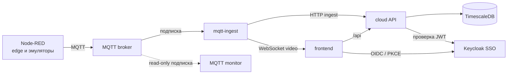

# Drill Cloud Docs

Общая документация Drill Cloud, которая относится сразу к нескольким сервисам. Инструкции, специфичные только для одного приложения, остаются в репозитории этого приложения.

## Документы

- [Локальный контур](local-development.md) — полный запуск Node-RED → MQTT → ingest → cloud → UI с серверным SSO.
- [Проверка системы](testing.md) — ручная проверка и запуск автоматизированного smoke-набора.
- [Сервисы и переменные окружения](services.md) — назначение репозиториев, порты и минимальная конфигурация.
- [Документация как сабмодуль](submodules.md) — подключение и обновление общей документации в сервисах.

## Схема системы

Основной поток данных в локальном контуре изолирован от общих стендов. Сервер `https://sso.drillcloud.ru` используется только для авторизации.

## Репозитории

| Компонент | Репозиторий |
|---|---|
| Backend API | [drill-cloud-backend](https://github.com/Drill-Cloud/drill-cloud-backend) |
| Frontend | [drill-cloud-frontend](https://github.com/Drill-Cloud/drill-cloud-frontend) |
| MQTT ingest | [drill-mqtt-ingest](https://github.com/Drill-Cloud/drill-mqtt-ingest) |
| Node-RED runtime | [drill-edge-nodered-setup](https://github.com/Drill-Cloud/drill-edge-nodered-setup) |
| Node-RED project edge5 | [drill-edge-nodered-edge5](https://github.com/Drill-Cloud/drill-edge-nodered-edge5) |
| MQTT monitor | [drill-mqtt-ingest-monitor](https://github.com/Drill-Cloud/drill-mqtt-ingest-monitor) |
| E2E и smoke-тесты | [drill-cloud-test](https://github.com/Drill-Cloud/drill-cloud-test) |
| Keycloak | [drill-cloud-keycloak](https://github.com/Drill-Cloud/drill-cloud-keycloak) |

## Правила безопасности

- Не добавляйте в Git `.env`, пароли БД, API-ключи, токены, RTSP credentials и `credentialSecret` Node-RED.
- Для локального контура используйте отдельные БД, MQTT broker и ключ ingest.
- Значения из примеров предназначены только для локального компьютера.
- Если секрет попал в историю Git или переписку, его необходимо заменить, а не только удалить из файла.
