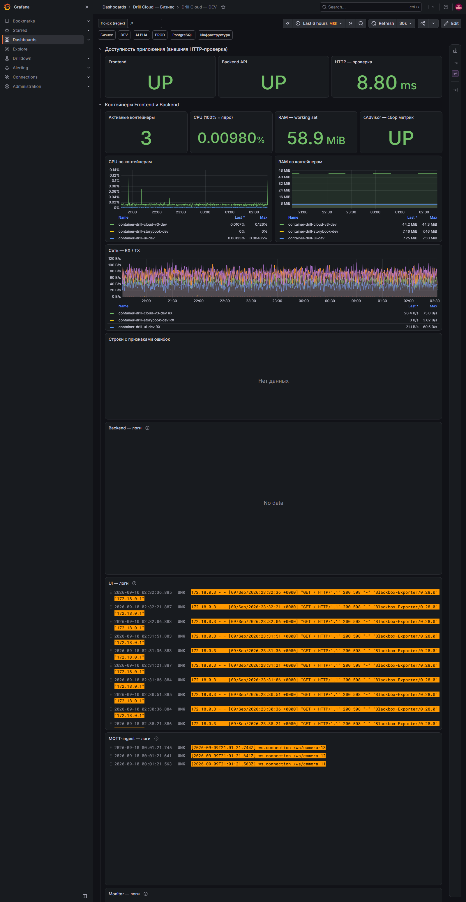
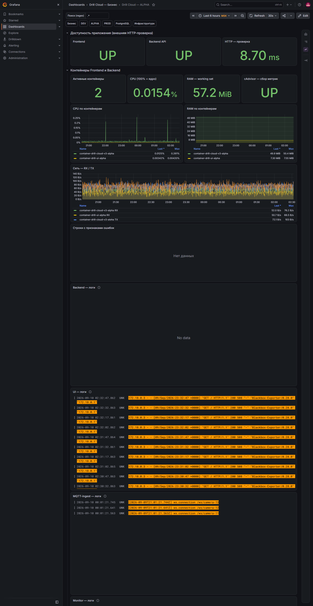
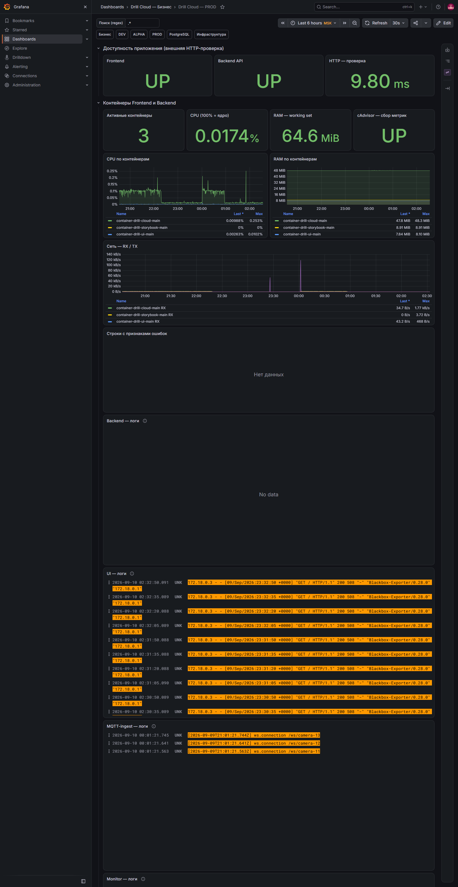

# Дашборды DEV, ALPHA и PROD

Три дашборда имеют одинаковую структуру. Это позволяет искать проблему по одному маршруту независимо от окружения:

- [DEV](https://grafana.drillcloud.ru/d/drill-cloud-dev/_?from=now-6h&to=now&timezone=Europe%2FMoscow&var-search=.%2A)
- [ALPHA](https://grafana.drillcloud.ru/d/drill-cloud-alpha/_?from=now-6h&to=now&timezone=Europe%2FMoscow&var-search=.%2A)
- [PROD](https://grafana.drillcloud.ru/d/drill-cloud-prod/_?from=now-6h&to=now&timezone=Europe%2FMoscow&var-search=.%2A)

## Какие вопросы закрывают

- доступен ли конкретный контур снаружи;
- запущены ли его Frontend и Backend;
- какой контейнер создаёт нагрузку;
- вырос ли поток ошибок;
- в каком из четырёх компонентов появилась первичная ошибка.

## DEV

DEV используется для ранней проверки изменений. Дашборд включает `frontend-dev`, `backend-dev`, общий MQTT-ingest и Monitor-dev. Ошибки и экспериментальные пики здесь допустимее, но повторяемая ошибка должна быть объяснена до продвижения в ALPHA.

## ALPHA

ALPHA — контур релиз-кандидата. Frontend и Backend отдельные, но Monitor-dev и база `cloud-dev` общие с DEV, а MQTT-ingest общий для всех сред. Перед приёмочным тестом UI и API должны быть `UP`, состав контейнеров стабилен, а необъяснённых повторяющихся ошибок быть не должно.

## PROD

PROD использует Frontend, Backend и Monitor без суффикса. Любой `DOWN`, исчезновение ожидаемого трафика или устойчивый поток ошибок имеет высокий приоритет. Общий MQTT-ingest требует проверки идентификатора установки: сообщение в его логе не всегда относится к PROD.

## Верхние панели: доступность

| Панель | Что показывает | Норма | Тревога |
|---|---|---|---|
| **Frontend** | Текущий результат внешней проверки UI | `UP` | `DOWN` больше одного обновления |
| **Backend API** | Текущий результат внешней проверки API | `UP` | `DOWN`, особенно при доступном UI |
| **HTTP — проверка** | Среднюю длительность внешней проверки | Стабильный привычный диапазон | Устойчивый рост или резкие повторяющиеся пики |

Если Frontend `DOWN`, а Backend `UP`, проверьте Frontend-контейнер, Nginx Proxy Manager, DNS и сертификат. Если Backend `DOWN`, начните с Backend-логов, состояния контейнера и PostgreSQL.

## Ресурсы Frontend и Backend

| Панель | Что показывает | Норма | Тревога |
|---|---|---|---|
| **Активные контейнеры** | Число контейнеров Frontend/Backend выбранного контура | Соответствует ожидаемому составу стека | Резкое уменьшение или отсутствие одного сервиса |
| **CPU (100% = ядро)** | Суммарную загрузку; 100% соответствует одному занятому ядру | Короткие пики с возвратом | Долгая высокая загрузка и рост времени ответа |
| **RAM — working set** | Фактически удерживаемую память | Стабильный диапазон | Монотонный рост, приближение к лимиту, рестарты |
| **cAdvisor — сбор метрик** | Доступность источника контейнерных метрик | `UP` | `DOWN` — сначала восстановить наблюдаемость |
| **CPU по контейнерам** | Вклад каждого Frontend/Backend-контейнера | Нагрузка объясняется активностью | Один сервис устойчиво выбивается из обычного уровня |
| **RAM по контейнерам** | Память каждого контейнера | Стабилизируется после запуска | Рост без плато или скачок после релиза |
| **Сеть — RX / TX** | Приём и передачу данных | Соответствует пользовательской и MQTT-активности | Исчезновение трафика при работающем сервисе или необъяснимый всплеск |

## Индикатор ошибок

**Строки с признаками ошибок** считает сообщения, содержащие `error`, `fatal`, `exception`, `panic` или `failed`. Это навигационный индикатор, а не готовый диагноз: слово `failed` может встретиться в обработанной бизнес-ситуации, а реальная проблема может логироваться иначе.

- Норма: нет устойчивого роста; единичные строки объяснимы.
- Тревога: всплеск совпадает с `DOWN`, ростом latency или жалобой пользователя.
- Действие: выделить интервал и перейти к соответствующей области логов.

## Четыре области логов

Логи намеренно расположены отдельными полноширинными областями, чтобы не смешивать разные этапы обработки.

### Backend — логи

Ищите ошибки API, Keycloak/JWT, SQL, соединения с PostgreSQL, stack trace и `5xx`. Первое исключение обычно полезнее последующих повторов.

### UI — логи

Это логи Frontend-контейнера/Nginx: запросы, HTTP-коды, выдача статики и маршруты. Ошибки JavaScript браузера сюда попадают не всегда — для них нужны Playwright diagnostics или консоль браузера.

### MQTT-ingest — логи

Показывают приём MQTT, маршрутизацию сообщений и ошибки обработчиков. Для каждой строки фиксируйте edge/topic; сервис общий для трёх контуров.

### Monitor — логи

Показывают контроль потока каналов и отправку уведомлений. DEV и ALPHA используют Monitor-dev, PROD — Monitor без суффикса.

## Порядок чтения одного инцидента

1. Поставьте одинаковый период на всех панелях.
2. Найдите первое отклонение в доступности или ресурсах.
3. Откройте Backend-логи вокруг этого времени.
4. Если проблема связана с поступлением данных, последовательно прочитайте MQTT-ingest и Monitor.
5. Если есть SQL/connection/timeout, откройте PostgreSQL.
6. Зафиксируйте первое сообщение, затронутый edge и время MSK.
