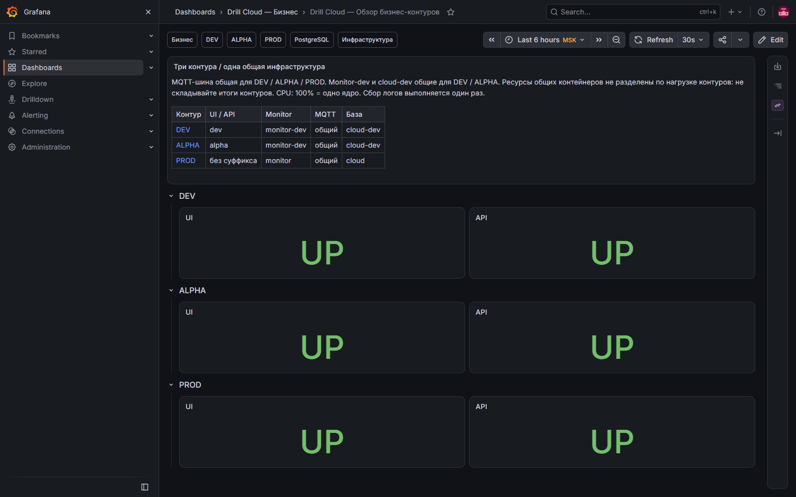
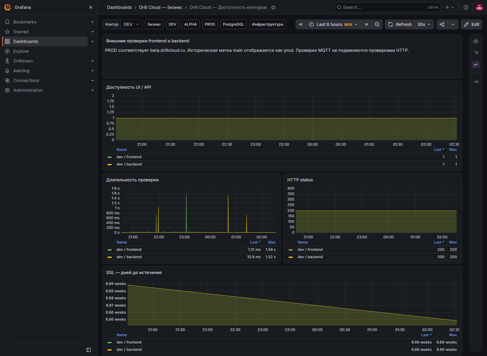

# Обзор и доступность контуров

Эти два экрана отвечают на первый вопрос инцидента: **какой контур недоступен и когда это началось**.

## Обзор бизнес-контуров

[Открыть дашборд](https://grafana.drillcloud.ru/d/drill-cloud-business-overview/_?from=now-6h&to=now&timezone=Europe%2FMoscow)

### Какие вопросы закрывает

- доступны ли DEV, ALPHA и PROD прямо сейчас;
- проблема затронула только UI, только API или весь контур;
- нужно ли немедленно переходить к PROD-разбору.

| Блок | Что показывает | Норма | Тревога и следующий шаг |
|---|---|---|---|
| **Три контура / одна общая инфраструктура** | Связь UI/API с общими Monitor, MQTT и БД | Схема соответствует карте сервисов | Если проблема в общем сервисе, проверить все затронутые контуры |
| **DEV — UI / API** | Текущую внешнюю HTTP-проверку dev | Оба `UP` | `DOWN` → открыть DEV и **Доступность** |
| **ALPHA — UI / API** | Текущую внешнюю HTTP-проверку alpha | Оба `UP` | `DOWN` → остановить приёмку релиз-кандидата и проверить ALPHA |
| **PROD — UI / API** | Текущую внешнюю HTTP-проверку production | Оба `UP` | Любой `DOWN` расследовать немедленно |

Зелёный обзор не доказывает корректность бизнес-сценария: он подтверждает только доступность контрольных HTTP-точек. После релиза его дополняет запуск P0-тестов.

## Доступность контуров

[Открыть дашборд](https://grafana.drillcloud.ru/d/drill-cloud-availability/_?from=now-6h&to=now&timezone=Europe%2FMoscow)

### Какие вопросы закрывает

- с какого момента сервис перестал отвечать;
- был ли это единичный сбой или длительная недоступность;
- отвечает ли контейнер медленно ещё до полного падения;
- корректен ли HTTP-ответ и не истекает ли сертификат.

| Панель | Что показывает | Норма | Когда действовать |
|---|---|---|---|
| **Контур** | Выбор DEV, ALPHA или PROD | Выбран исследуемый контур | Неверный контур приводит к ложным выводам |
| **Доступность UI / API** | Историю `probe_success`: 1 — успех, 0 — ошибка | Непрерывная линия на 1 | Провал до 0 → зафиксировать время и перейти в логи контура |
| **Длительность проверки** | Полное время внешнего HTTP-запроса | Около обычного уровня | Устойчивый рост → проверить Backend, proxy и хост |
| **HTTP status** | Код ответа UI и API | `2xx` | `3xx` — проверить маршрут; `4xx/5xx` — авторизация, proxy или приложение |
| **SSL — дней до истечения** | Остаток срока сертификата | Больше 30 дней | Меньше 30 — запланировать; меньше 7 — исправлять срочно |

### Как пользоваться

1. Выберите контур.
2. Сузьте период вокруг первого провала `probe_success`.
3. Сравните UI и API: если падает только UI, начните с Frontend/NPM; если API — с Backend и БД.
4. Откройте дашборд контура с тем же периодом.
5. Сопоставьте момент с рестартом контейнера, нагрузкой и первой ошибкой в логах.
