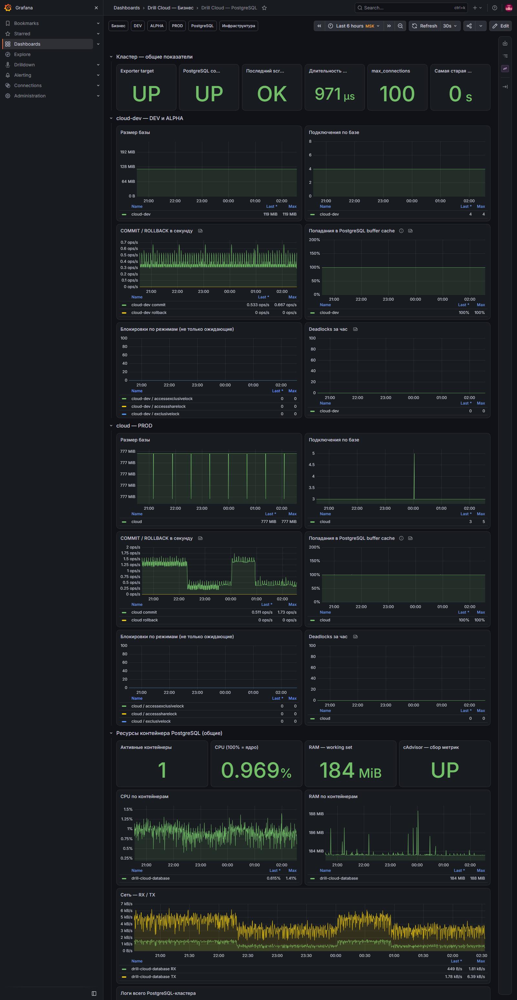

# PostgreSQL: `cloud-dev` и `cloud`

[Открыть дашборд](https://grafana.drillcloud.ru/d/drill-cloud-postgres/_?from=now-6h&to=now&timezone=Europe%2FMoscow)

Один PostgreSQL-контейнер содержит две прикладные базы. `cloud-dev` используется DEV и ALPHA, `cloud` — PROD. Один postgres-exporter подключается к служебной базе и отдаёт метрики по обеим базам с меткой `datname`.

## Какие вопросы закрывает

- собираются ли метрики PostgreSQL;
- доступна ли база exporter-пользователю;
- растёт ли размер базы и число подключений;
- увеличились ли rollback, блокировки или deadlock;
- не удерживает ли длительная транзакция ресурсы;
- связана ли проблема приложения с ресурсами контейнера БД.

## Кластер — общие показатели

| Панель | Что показывает | Норма | Тревога и действие |
|---|---|---|---|
| **Exporter target** | Доступность postgres-exporter для Prometheus | `UP` | `DOWN` → сеть, контейнер exporter, Prometheus target |
| **PostgreSQL connection** | Может ли exporter подключиться к PostgreSQL | `UP` | `DOWN` → DSN, пароль, `pg_hba.conf`, права |
| **Последний scrape без ошибок** | Результат последнего сбора | Успех | Ошибка → логи exporter и запросы collector |
| **Длительность scrape** | Время полного сбора | Стабильный уровень | Резкий/устойчивый рост → нагрузка или медленное соединение |
| **max_connections** | Настроенный предел подключений | Есть запас относительно факта | Фактические подключения приближаются к пределу |
| **Самая старая транзакция** | Возраст самой долгой открытой транзакции | Низкий и не растёт постоянно | Рост → найти сессию, проверить блокировки и Backend |

Если все панели показывают `No data`, это не нулевая нагрузка. Сначала должны стать `UP` **Exporter target** и **PostgreSQL connection**.

## Панели каждой базы

Одинаковый набор повторяется для `cloud-dev` и `cloud`.

| Панель | Что показывает | Норма | Тревога |
|---|---|---|---|
| **Размер базы** | Размер БД во времени | Предсказуемый рост | Ускорение без ожидаемого объёма данных |
| **Подключения по базе** | Число соединений | Стабильный запас до `max_connections` | Рост к пределу или резкие волны подключений |
| **COMMIT / ROLLBACK в секунду** | Успешные и отменённые транзакции | Commit соответствует активности, rollback редок | Рост rollback вместе с Backend/SQL errors |
| **Попадания в buffer cache** | Долю чтений из памяти | Стабильна для обычной нагрузки | Падение вместе с высоким Disk I/O и latency |
| **Блокировки по режимам** | Все lock-объекты, не только ожидающие | Обычный фон | Аномальный рост, особенно с долгой транзакцией |
| **Deadlocks за час** | Взаимные блокировки | `0` | Любое значение больше 0 требует разбора запросов |

`cloud-dev` нельзя корректно разделить на DEV и ALPHA только по метрике базы. Для атрибуции используйте время, Backend-контейнер и признаки запроса в логах.

## Ресурсы контейнера PostgreSQL

| Панель | Что показывает | Как читать |
|---|---|---|
| **Активные контейнеры** | Работает ли контейнер БД | Отсутствие контейнера объясняет недоступность обеих баз |
| **CPU / RAM / cAdvisor** | Общие ресурсы и исправность сбора | Сравнивать с транзакциями, сетью и Disk I/O хоста |
| **CPU по контейнерам** | Загрузку PostgreSQL | Длительный пик — повод искать тяжёлые запросы |
| **RAM по контейнерам** | Память процесса и cache | Оценивать вместе с лимитом контейнера и памятью хоста |
| **Сеть — RX / TX** | Обмен с приложениями | Исчезновение трафика может быть следствием остановки клиентов |
| **Логи всего PostgreSQL-кластера** | Ошибки авторизации, SQL, recovery, checkpoint | Сопоставлять с Backend-логами по времени |

## Быстрый сценарий

1. Проверить три панели exporter.
2. Выбрать нужную базу: `cloud-dev` для DEV/ALPHA, `cloud` для PROD.
3. Сопоставить подключения, rollback, блокировки и старую транзакцию.
4. Проверить CPU/RAM контейнера и Disk I/O сервера.
5. Прочитать Backend и PostgreSQL логи в одном временном окне.
