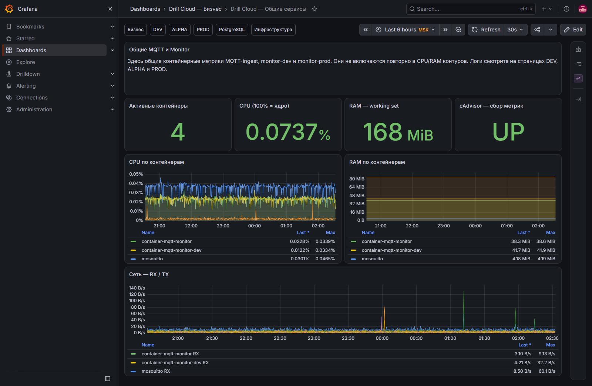

# Общие сервисы: MQTT-ingest и Monitor

[Открыть дашборд](https://grafana.drillcloud.ru/d/drill-cloud-services/_?from=now-6h&to=now&timezone=Europe%2FMoscow)

Дашборд вынесен отдельно, потому что общие сервисы могут влиять сразу на несколько контуров. MQTT-ingest общий для DEV, ALPHA и PROD; Monitor-dev обслуживает DEV и ALPHA, production Monitor — PROD.

## Какие вопросы закрывает

- работают ли контейнеры MQTT-ingest и Monitor;
- кто из них создаёт нагрузку;
- идёт ли ожидаемый сетевой поток;
- является ли проблема общей для нескольких контуров.

| Панель | Что показывает | Норма | Когда действовать |
|---|---|---|---|
| **Активные контейнеры** | Число найденных работающих контейнеров | Соответствует составу стека | Уменьшение → проверить Portainer и рестарты |
| **CPU (100% = ядро)** | Суммарную загрузку общих сервисов | Пики возвращаются к обычному уровню | Устойчивая загрузка и задержка обработки |
| **RAM — working set** | Удерживаемую процессами память | Стабилизируется | Рост без возврата или OOM/restart |
| **cAdvisor — сбор метрик** | Доступность контейнерных метрик | `UP` | `DOWN` делает ресурсные выводы ненадёжными |
| **CPU по контейнерам** | Вклад каждого контейнера | Нагрузка объяснима потоком данных | Один компонент постоянно доминирует |
| **RAM по контейнерам** | Память каждого контейнера | Обычный диапазон | Резкий рост после релиза |
| **Сеть — RX / TX** | Входящий/исходящий трафик | Есть ожидаемая активность | Ноль при активных установках или необъяснимый всплеск |

## Как отличить источник проблемы

- MQTT приходит, но Backend не обновляется: смотреть ошибки маршрутизации/HTTP в MQTT-ingest и Backend.
- Monitor сообщает об отсутствии данных, а трафик MQTT есть: сопоставить topic/edge и обработку конкретного канала.
- Одновременно пропали свежие данные в DEV, ALPHA и PROD: сначала проверять общий MQTT-ingest, broker и сеть.
- Проблема только в PROD-уведомлениях: проверять production Monitor; только в DEV/ALPHA — Monitor-dev.

!!! warning
    Высокая скорость логов сама по себе не означает проблему. Важны повторяемая ошибка, потеря ожидаемого трафика и совпадение по времени с симптомом в UI/API.
