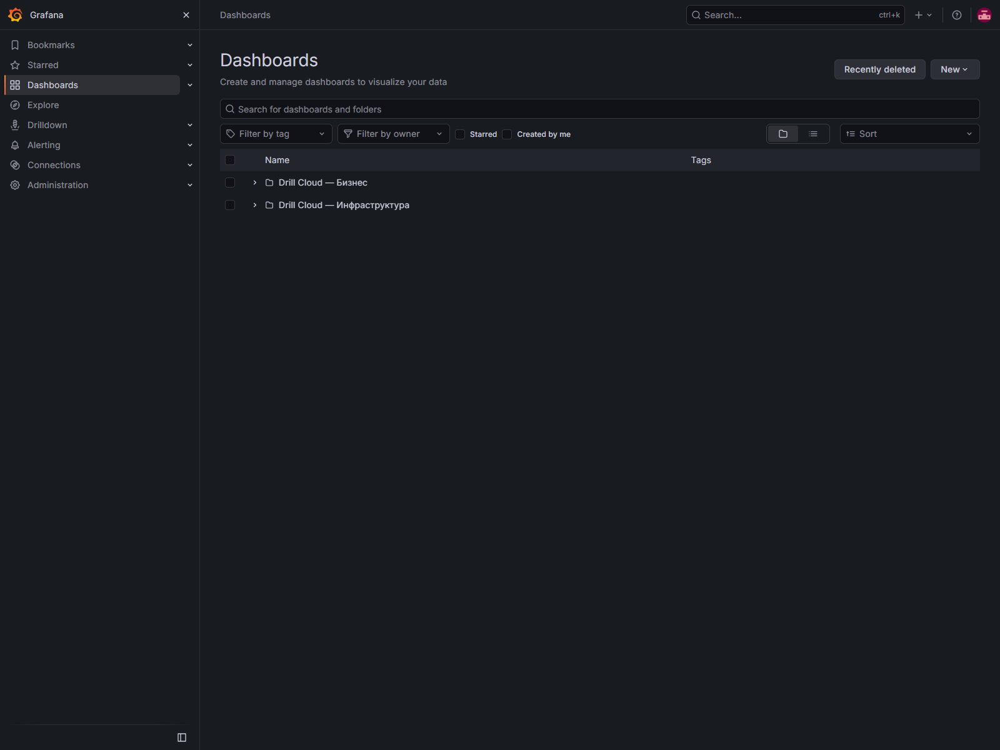

# Как пользоваться Grafana

Откройте [Grafana](https://grafana.drillcloud.ru/) и перейдите в **Dashboards**. Рабочие экраны разделены на папки **Drill Cloud — Бизнес** и **Drill Cloud — Инфраструктура**.



## Быстрый маршрут

1. Откройте **Drill Cloud — Обзор бизнес-контуров**.
2. Если UI или API недоступен, откройте **Доступность контуров** и определите момент начала.
3. Перейдите в DEV, ALPHA или PROD.
4. Проверьте контейнеры, CPU, RAM и сеть.
5. В том же интервале прочитайте отдельные области логов Backend, UI, MQTT-ingest и Monitor.
6. При признаках проблемы БД откройте **PostgreSQL**, при общей проблеме — инфраструктурные экраны.

## Верхняя панель

| Элемент | Для чего нужен |
|---|---|
| Хлебные крошки | Показывают папку и название дашборда |
| **Бизнес / DEV / ALPHA / PROD / PostgreSQL / Инфраструктура** | Быстро переключают основные экраны |
| **Last 6 hours** | Задаёт период; для инцидента выберите узкий интервал вокруг события |
| **MSK** | Подтверждает отображение времени по Москве |
| Стрелки около периода | Сдвигают временное окно назад или вперёд |
| **Refresh** | Обновляет данные вручную |
| **30s** | Автообновление; при изучении старого инцидента его лучше выключить |
| **Edit** | Редактирование дашборда; для обычного просмотра не требуется |

## Фильтры

- **Поиск (regex)** фильтрует логи регулярным выражением. `.*` показывает все строки.
- **stack** ограничивает данные одним стеком.
- **container** ограничивает данные конкретным контейнером выбранного стека.
- После смены фильтра дождитесь обновления всех панелей и проверьте, что временной диапазон не сбросился.

Примеры поиска:

```text
error|fatal|exception|panic|failed
edge5
timeout|connection refused
401|403|500|502|503
```

## Как читать состояния

| Состояние | Значение | Действие |
|---|---|---|
| `UP` | Проверка успешна | Перейти к следующему уровню проверки |
| `DOWN` | Проверка неуспешна | Проверить маршрут, контейнер и логи |
| `0` | Метрика получена, значение равно нулю | Это нормальное числовое значение, если ноль ожидаем |
| `No data` / `Нет данных` | Источник не вернул временной ряд | Проверить период, фильтр, target и работу сборщика |

`No data` не равно нулю. Например, это может означать отсутствие событий, неверный фильтр Loki, остановку exporter или отсутствие метрик у Prometheus.

## Работа с графиком и логами

- Выделите мышью интервал на графике, чтобы приблизить его.
- Нажмите название ряда в легенде, чтобы скрыть или вернуть его.
- Наведите курсор на график, чтобы увидеть точное значение и время.
- В логах начинайте с сообщения ошибки, затем читайте строки до и после него.
- Всегда фиксируйте контур, контейнер, идентификатор установки, время MSK и версию релиза.

!!! tip
    Если экран кажется противоречивым, сначала сбросьте regex в `.*`, расширьте период до 6 часов и проверьте дашборд **Состояние мониторинга**.
