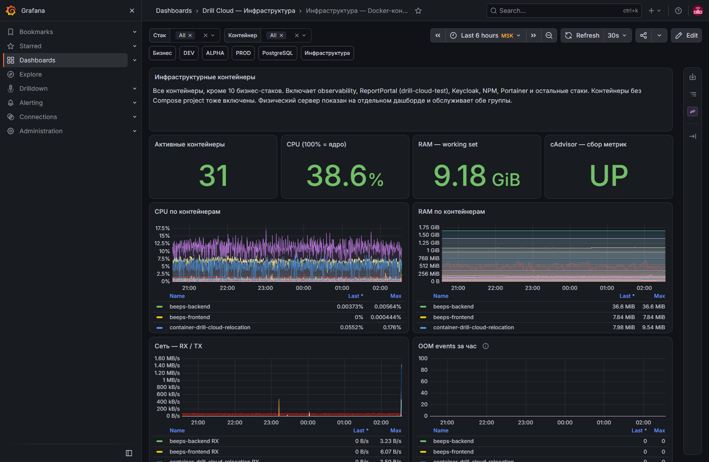

# Инфраструктура — Docker-контейнеры

[Открыть дашборд](https://grafana.drillcloud.ru/d/drill-cloud-containers/_?from=now-6h&to=now&timezone=Europe%2FMoscow)

Экран показывает инфраструктурные контейнеры: observability, ReportPortal, Keycloak, Nginx Proxy Manager, Portainer и другие компоненты вне десяти бизнес-стеков и PostgreSQL.

## Как пользоваться

1. В фильтре **stack** выберите нужный стек.
2. При необходимости сузьте **container**.
3. Выберите период вокруг события.
4. Сравните CPU, RAM и сеть.
5. Для текста ошибки перейдите в [инфраструктурные логи](logs.md).

| Панель | Что показывает | Норма | Тревога |
|---|---|---|---|
| **Активные контейнеры** | Число работающих выбранных контейнеров | Соответствует ожидаемому стеку | Контейнер исчез или постоянно перезапускается |
| **CPU total** | Суммарную загрузку | Краткие объяснимые пики | Устойчивая нагрузка и деградация сервиса |
| **RAM working set** | Суммарную память | Стабилизируется | Рост без возврата или приближение к лимиту |
| **cAdvisor** | Исправность сбора контейнерных метрик | `UP` | `DOWN` — ресурсные панели могут врать/пустовать |
| **CPU по контейнерам** | Распределение процессора | Нет неожиданного доминирования | Один контейнер выбивается после изменения |
| **RAM по контейнерам** | Память каждого контейнера | Обычный диапазон | Утечка или внезапный скачок |
| **Сеть RX / TX** | Трафик контейнеров | Соответствует назначению | Пропал ожидаемый поток или возник всплеск |
| **OOM events за час** | События завершения процессов из-за нехватки памяти | `0` | Любое ненулевое значение требует проверки лимитов и хоста |

`No data` в OOM-панели не доказывает отсутствие OOM: дополнительно проверьте события Docker/Portainer и логи хоста.
