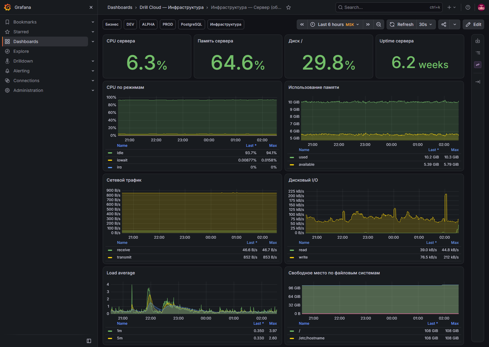

# Инфраструктура — сервер

[Открыть дашборд](https://grafana.drillcloud.ru/d/drill-cloud-host/_?from=now-6h&to=now&timezone=Europe%2FMoscow)

Экран отвечает на вопрос: **не является ли общий хост причиной проблем сразу у нескольких контейнеров**.

| Панель | Что показывает | Норма | Когда действовать |
|---|---|---|---|
| **CPU сервера** | Общую загрузку процессора | Есть запас, пики кратковременны | Высокая нагрузка держится и влияет на latency |
| **Память сервера** | Использованную память | Есть доступная память | Дефицит, swap, OOM или рестарты контейнеров |
| **Диск /** | Заполнение корневой ФС | Командный ориентир — ниже 80% | 80% — план очистки; 90% — срочно |
| **Uptime сервера** | Время после загрузки | Соответствует ожидаемой эксплуатации | Неожиданно мал — был рестарт хоста |
| **CPU по режимам** | User, system, iowait и другие режимы | Нет устойчивого iowait | Высокий iowait → искать проблему диска/БД |
| **Использование памяти** | Динамику used/available | Стабильный диапазон | Доступная память постоянно уменьшается |
| **Сетевой трафик** | RX/TX интерфейсов | Соответствует активности | Обрыв или необъяснимый всплеск |
| **Дисковый I/O** | Чтение/запись дисков | Пики объяснимы БД, backup, деплоем | Длительная высокая активность и iowait |
| **Load average** | Очередь задач за 1/5/15 минут | Не держится выше числа CPU-ядер | Длительное превышение указывает на перегрузку |
| **Свободное место по ФС** | Остаток по разделам | Достаточный запас | Быстрое падение или заполнение раздела |

Порог 80/90% для диска — эксплуатационная рекомендация, а не автоматически настроенное правило Grafana. После установления обычного уровня команды следует закрепить реальные alert thresholds.
