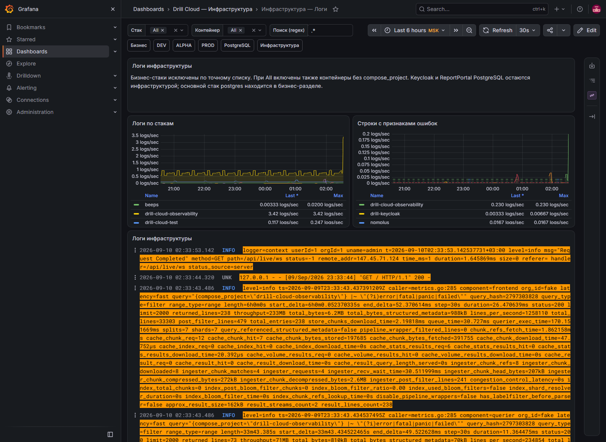

# Инфраструктура — логи

[Открыть дашборд](https://grafana.drillcloud.ru/d/drill-cloud-infra-logs/_?from=now-6h&to=now&timezone=Europe%2FMoscow)



Экран объединяет логи инфраструктурных стеков. Бизнес-логи и PostgreSQL находятся на своих дашбордах, чтобы не смешивать причины разных уровней.

| Блок | Что показывает | Как использовать |
|---|---|---|
| **stack / container / search** | Область и regex-фильтр | Сначала стек, затем контейнер, затем текст |
| **Логи по стакам** | Скорость появления строк | Найти стек с неожиданным всплеском |
| **Строки с признаками ошибок** | Частоту `error/fatal/exception/panic/failed` | Выделить время всплеска |
| **Логи инфраструктуры** | Полные строки выбранных контейнеров | Читать контекст до и после первой ошибки |

## Практические фильтры

```text
error|fatal|exception|panic|failed
timeout|connection refused|unreachable
out of memory|oom|killed
certificate|tls|x509
```

Норма — отсутствие устойчивого повторения одной ошибки. Единичную строку оценивайте по контексту: некоторые сервисы логируют восстановившуюся попытку как error, а некоторые критические состояния не содержат слова `error`.
