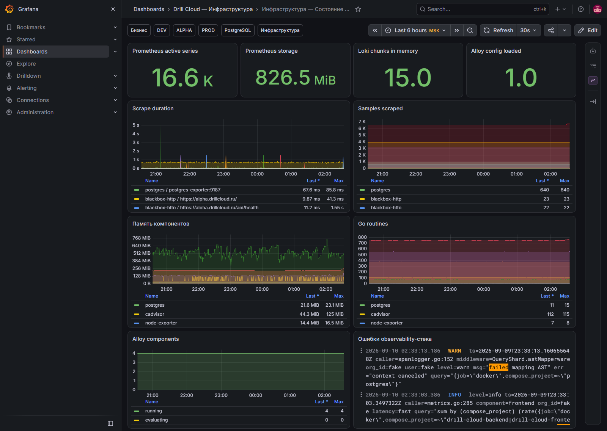

# Инфраструктура — состояние мониторинга

[Открыть дашборд](https://grafana.drillcloud.ru/d/drill-cloud-observability/_?from=now-6h&to=now&timezone=Europe%2FMoscow)

Этот экран проверяют, когда на других дашбордах неожиданно появляется `No data`. Он отвечает на вопрос: **не сломалась ли сама система наблюдаемости**.

| Панель | Что показывает | Норма | Тревога |
|---|---|---|---|
| **Prometheus active series** | Число активных временных рядов | Стабильный ожидаемый порядок | Резкое падение — потеря targets; резкий рост — кардинальность |
| **Prometheus storage** | Размер хранилища метрик | Предсказуемый рост | Ускорение роста и нехватка диска |
| **Loki chunks in memory** | Активные фрагменты логов в памяти | Стабильный уровень | Рост вместе с потоком логов и RAM |
| **Alloy config loaded** | Успешность загрузки конфигурации | Успех | Ошибка после redeploy — проверить конфиг Alloy |
| **Scrape duration** | Время опроса targets | Меньше интервала scrape с запасом | Рост/таймаут конкретного target |
| **Samples scraped** | Число полученных образцов | Есть данные от ожидаемых targets | Падение к нулю — сбор прекратился |
| **Память компонентов** | RAM observability-сервисов | Стабилизируется | Рост без возврата или рестарты |
| **Go routines** | Число goroutine Go-компонентов | Обычный диапазон | Неконтролируемый длительный рост |
| **Alloy components** | Состояния компонентов pipeline | Рабочие состояния | Error/failed/evaluating без завершения |
| **Ошибки observability-стека** | Проблемные строки Grafana/Prometheus/Loki/Alloy | Нет повторяемой ошибки | Повторяется ошибка ingest, scrape, storage или config |

## Порядок проверки `No data`

1. Убедиться, что выбран правильный период и фильтр.
2. Проверить cAdvisor на исходном дашборде.
3. Проверить Prometheus samples для метрик или Loki/Alloy для логов.
4. Найти проблемный target/компонент.
5. Только после восстановления сбора делать вывод о состоянии бизнес-сервиса.
