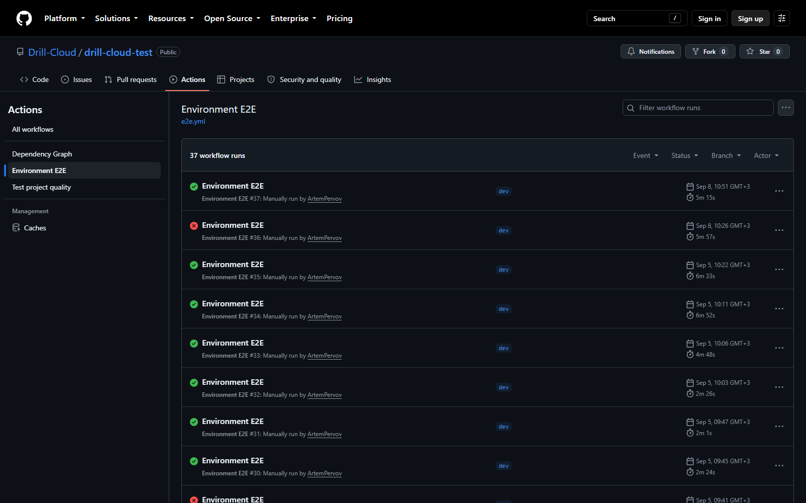
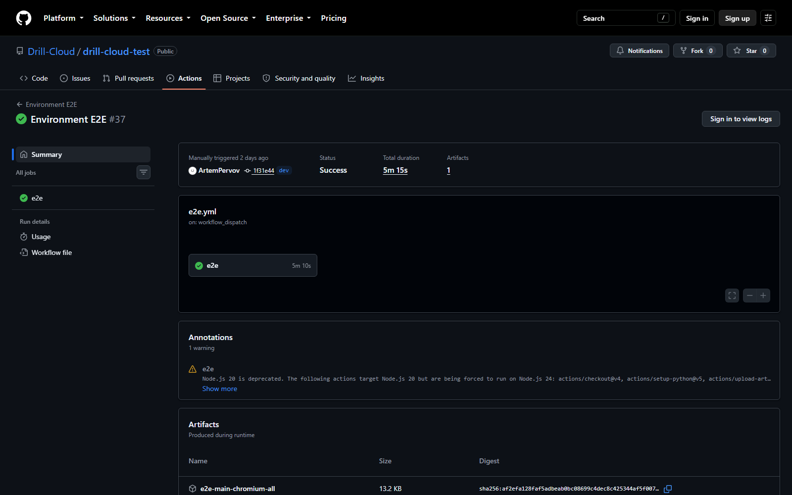

# Ручной запуск в GitHub Actions

Workflow `Environment E2E` запускается только вручную через `workflow_dispatch`. Он не подписан на `push` или `pull_request` и не должен быть обязательным status check, поэтому не блокирует merge.



## Как запустить

1. Откройте репозиторий [`drill-cloud-test`](https://github.com/Drill-Cloud/drill-cloud-test).
2. Перейдите в **Actions**.
3. Слева выберите **Environment E2E**.
4. Нажмите **Run workflow**.
5. Выберите ветку, в которой находится актуальный workflow.
6. Заполните три параметра:

| Поле | Значения | Что выбрать обычно |
|---|---|---|
| **environment** | `dev`, `alpha`, `main` | Контур, на котором развернута проверяемая версия |
| **profile** | `p0`, `p1`, `p2`, `nightly`, `all` | После деплоя — `p0`; перед релизом — `p0` и `p1` |
| **browser** | `chromium`, `firefox`, `webkit` | Сначала `chromium` |

7. Подтвердите запуск и дождитесь завершения job `e2e`.

!!! note
    Ветка workflow и поле `environment` — разные вещи. Ветка определяет версию тестового кода, а `environment` выбирает URL, секреты и variables стенда. На скриншоте успешный run создан из ветки `dev`, но мог проверять любое выбранное окружение.

## Рекомендуемые запуски

```text
DEV:   environment=dev,   profile=p0, browser=chromium
ALPHA: environment=alpha, profile=p0, browser=chromium
ALPHA: environment=alpha, profile=p1, browser=chromium
PROD:  environment=main,  profile=p0, browser=chromium
```

На `main` workflow принудительно исключает тесты с marker `settings`, потому что они временно меняют пользовательские настройки. Seed и live publisher на `main` также запрещены проверкой конфигурации.

## Как читать страницу run



| Блок | Что означает |
|---|---|
| **Status** | Итог всего job: success или failure |
| **Total duration** | Полное время запуска, включая установку и ожидание сервисов |
| **e2e** | Единственный основной job; откройте его для логов шагов |
| **Annotations** | Предупреждения runner/actions; не каждое предупреждение является падением теста |
| **Artifacts** | HTML, JUnit, trace, screenshots, video и diagnostics, хранятся 30 дней |

## Этапы job

1. Checkout тестового репозитория.
2. Python 3.12 и pip cache.
3. Проверка обязательной конфигурации.
4. Ожидание UI и `GET /api/health`.
5. Установка Python-пакета и выбранного браузера Playwright.
6. Опциональный seed/live publisher только для DEV/ALPHA.
7. Запуск pytest выбранного профиля и публикация в ReportPortal.
8. Формирование summary и загрузка артефактов даже при падении.

Зависимости Python используют cache, но Playwright выполняет `install --with-deps` в каждом GitHub-hosted runner. Это делает запуск воспроизводимым; ускорить браузерную часть можно отдельным cache или self-hosted runner, но это самостоятельное изменение CI.
