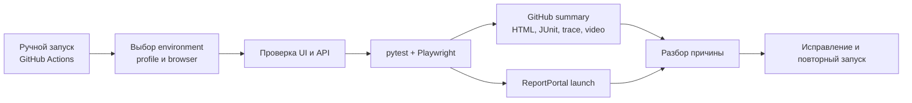

# Автотестирование Drill Cloud

Автотесты находятся в репозитории [`drill-cloud-test`](https://github.com/Drill-Cloud/drill-cloud-test) и проверяют приложение через браузер и HTTP API. Основа — Python, pytest и Playwright; результаты сохраняются в GitHub Actions и публикуются в ReportPortal.

## Какие вопросы закрывает система

- открывается ли приложение и проходит ли вход через Keycloak;
- корректны ли список установок, обзор, текущие показатели, архив, видео и настройки;
- соблюдаются ли роли доступа;
- корректны ли основные API-контракты и обработка ошибок;
- не появились ли визуальные, responsive, accessibility и runtime-регрессии;
- на каком шаге сломался сценарий и какие screenshot/trace/log помогут разобраться.

## Полный цикл

## Где запускать и где смотреть

| Действие | Место |
|---|---|
| Запустить тесты | `drill-cloud-test → Actions → Environment E2E → Run workflow` |
| Увидеть итог job | Страница конкретного GitHub Actions run |
| Скачать подробные артефакты | Блок **Artifacts** на странице run |
| Сравнить запуски и падения | Проект `drill_cloud` в [ReportPortal](https://reportportal.drillcloud.ru/) |
| Проверить состояние сервисов во время падения | [Grafana](https://grafana.drillcloud.ru/) |

## Что хранится в отчётах

- HTML-отчёт `reports/e2e-report.html`;
- JUnit XML `reports/junit.xml`;
- Playwright trace, screenshot и video для упавших тестов;
- `browser-diagnostics.txt` с console errors, page errors и failed requests;
- в ReportPortal — launch с атрибутами environment/browser/profile и ссылкой на GitHub run.

## Базовый выпускной маршрут

1. После деплоя проверить доступность контура в Grafana.
2. Запустить `p0 / chromium` для нужного environment.
3. Для ALPHA перед релизом дополнительно выполнить `p1`.
4. Периодически или перед крупным выпуском выполнить `p2` и второй браузер.
5. Разобрать каждый `FAILED`; каждый `SKIPPED` должен быть ожидаем и объяснён конфигурацией.
6. Сохранить ссылки на run и ReportPortal launch в задаче релиза.

!!! important
    Зелёный job означает, что все выбранные и применимые проверки прошли. Он не означает, что пропущенный сценарий был проверен. Всегда смотрите количество `passed`, `failed`, `skipped` и выбранный профиль.
