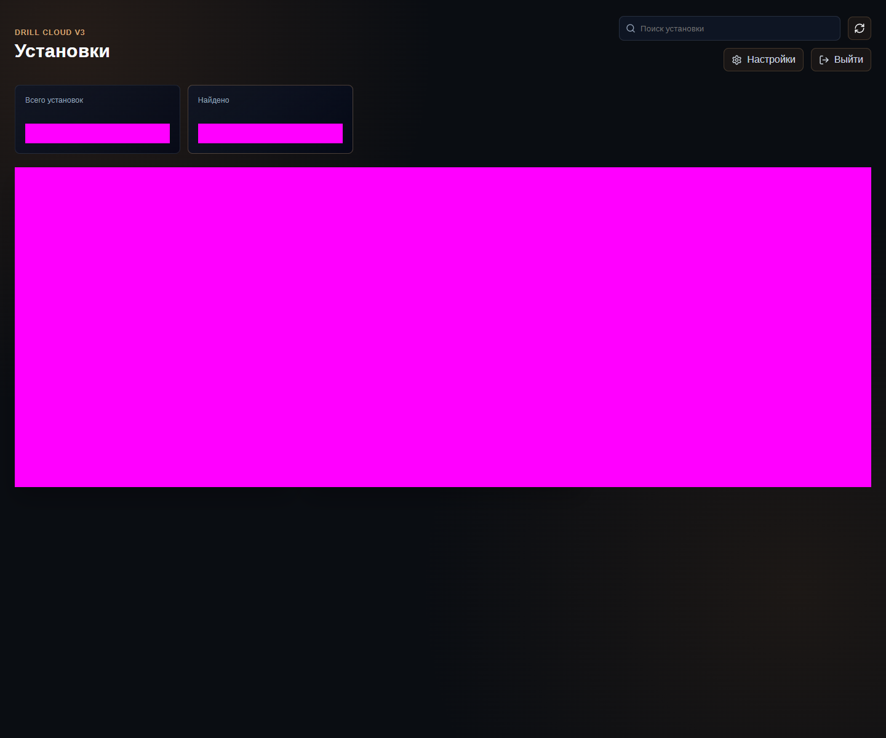
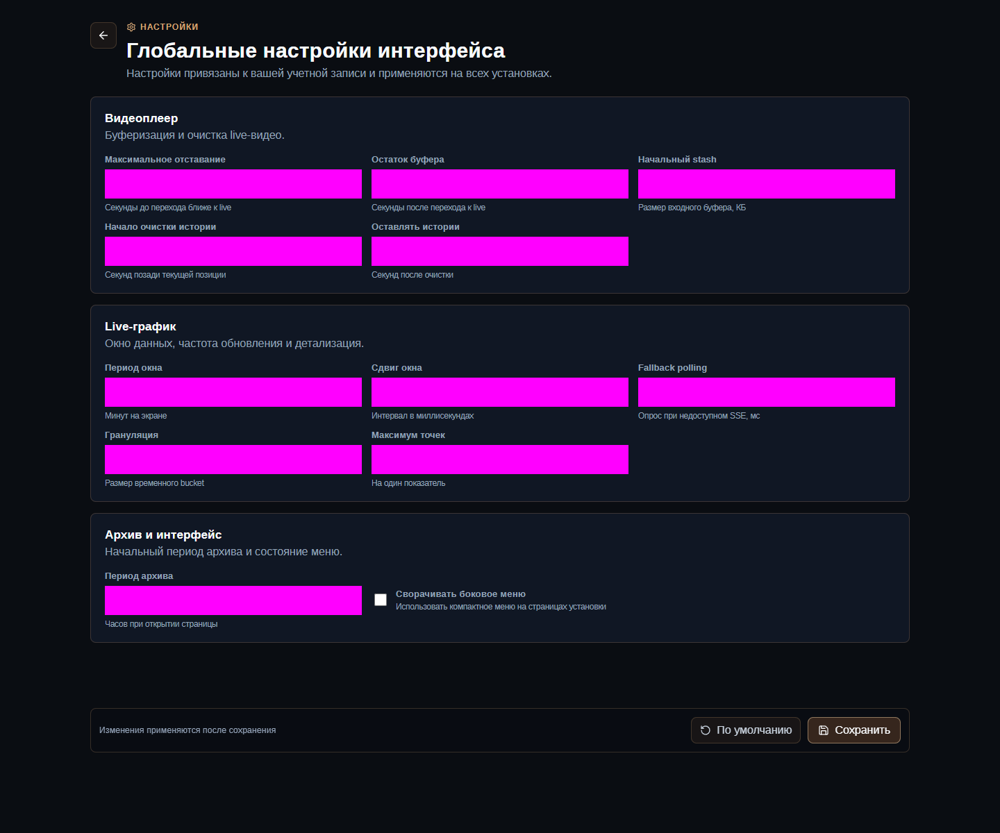

# Профили и покрытие тестов

Профиль определяет набор pytest markers. Выбор профиля должен отвечать цели запуска, а не стремлению всегда запускать максимум.

## Профили

| Профиль | Состав | Когда запускать | Ожидаемый результат |
|---|---|---|---|
| `p0` | Обязательный smoke | После каждого деплоя | Все применимые тесты прошли |
| `p1` | Расширенные интеграционные и ролевые сценарии | Перед релизом, на ALPHA | Все сценарии с подготовленными данными прошли |
| `p2` | Негативные, accessibility, responsive, runtime и visual | Периодически и перед крупным выпуском | Нет необъяснённых регрессий |
| `nightly` | `p0 or p1` | Расширенная регулярная проверка | P0/P1 зелёные, skips согласованы |
| `all` | Всё, кроме unit-тестов инфраструктуры проекта | Полная проверка | Требует наиболее полного стенда |

На `main` к marker-выражению добавляется `not settings`.

## P0 — выпускной smoke

| Область | Что проверяется |
|---|---|
| Health | `GET /api/health` и JSON-ответ |
| Auth | Keycloak-вход, сохранение сессии, прямой URL, выход |
| Edges | Список, статистика, refresh, поиск, карточка установки |
| Overview | Summary, статус SSE/polling, маршруты разделов |
| Current | Виджеты, поиск, live-график или корректный empty state |
| History | Выбор показателя, график/empty state, период 1 час |
| Video | Камера и корректное состояние буровой без камер |
| Settings | Сохранение, reload и восстановление исходного значения |

P0 — минимальный критерий после деплоя. `FAILED` всегда разбирается. `SKIPPED` допустим только если причина заранее известна и сценарий неприменим к стенду.

## P1 — расширенная проверка

| Область | Что проверяется | Что нужно подготовить |
|---|---|---|
| Live update | Значение меняется без reload | `E2E_LIVE_TAG` и источник изменений |
| History | Несколько графиков и API-контракт | Показатель с историей |
| Realtime | Одно SSE-соединение, отсутствие дублей, fallback polling | Рабочий realtime-контур |
| Video | Закрытие WebSocket и одно соединение после возврата | Буровая с камерой |
| Roles | admin, edge-only, no-role | Три пары учётных данных |
| Settings isolation | Разделение настроек пользователей | Ролевые учётные записи |

## P2 — качество и негативные сценарии

| Область | Что проверяется |
|---|---|
| API errors | Безопасный UI при ответах API 500 |
| Accessibility | Accessible names, duplicate IDs, клавиатура |
| Responsive | Ширины 1024–1920 и отсутствие нежелательного overflow |
| Runtime | Бюджет запросов current и неизвестный SPA-маршрут |
| Visual | Сравнение утверждённых PNG-baseline со снимком текущей версии |

## Как устроены visual baselines

Динамические области замаскированы пурпурным цветом и не участвуют в структурном сравнении. Это позволяет проверять компоновку, не привязываясь к названиям установок и текущим значениям.

Visual-падение не следует лечить произвольным увеличением допуска. Сначала откройте actual и diff из `test-results/visual/<browser>`, определите, изменился ли реальный интерфейс, и только затем либо исправьте UI, либо осознанно обновите baseline.

## Не покрыто полностью

- неверный пароль Keycloak не автоматизирован, чтобы не запускать защиту от перебора;
- математическая корректность каждого пикселя ECharts/avg-линии требует ручной исследовательской проверки;
- длительные memory/performance-прогоны видео остаются отдельной нагрузочной задачей;
- внешняя интеграция Яндекс.Диска MQTT-ingest требует отдельного integration suite.
