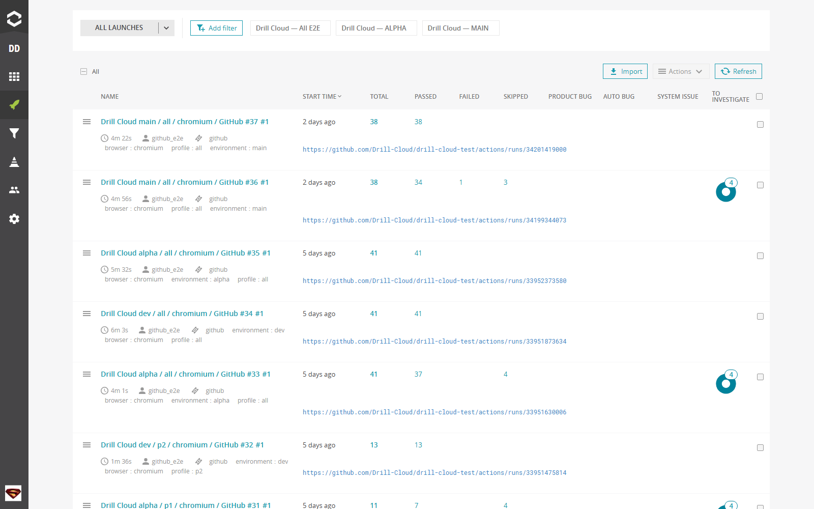

# Результаты в ReportPortal

[ReportPortal Drill Cloud](https://reportportal.drillcloud.ru/) хранит историю запусков и помогает сравнивать повторяющиеся падения. GitHub Actions остаётся источником CI-статуса и артефактов, ReportPortal — рабочим экраном анализа тестов.



На общем экране видны имя и длительность launch, общее число тестов, `passed`, `failed`, `skipped` и распределение дефектов. Быстрые фильтры сверху позволяют перейти к общему набору или отдельному окружению. Ссылка под launch ведёт к соответствующему GitHub Actions run.

## Как найти запуск

1. Войдите в ReportPortal под своей учётной записью.
2. Выберите проект `drill_cloud`.
3. Откройте **Launches**.
4. Найдите запуск по имени:

```text
Drill Cloud <environment> / <profile> / <browser> / GitHub #<run-number>
```

5. Проверьте атрибуты `environment:*`, `browser:*`, `profile:*` и ссылку на GitHub Actions в description.

## Как читать результат

| Статус | Значение | Действие |
|---|---|---|
| `PASSED` | Проверка выполнена и ожидание подтверждено | Дополнительных действий нет |
| `FAILED` | Assertion, ошибка приложения, данных или окружения | Открыть тест, логи и вложения |
| `SKIPPED` | Тест не выполнялся | Прочитать причину и решить, допустим ли пропуск |
| Product Bug | Подтверждённый дефект продукта | Ссылка на задачу и повторная проверка после исправления |
| Automation Bug | Ошибка тестового кода/baseline/selector | Исправить `drill-cloud-test` |
| System Issue | Проблема стенда, сети или зависимого сервиса | Восстановить окружение и перезапустить |
| To Investigate | Причина ещё не определена | Не считать релиз проверенным до классификации |

## Порядок разбора падения

1. Откройте первый упавший тест, а не последний каскадный.
2. Прочитайте assertion и шаг сценария.
3. Посмотрите `failure.png` и `browser-diagnostics.txt`, если они приложены.
4. Перейдите по ссылке на GitHub run и скачайте artifact для trace/video/HTML.
5. В Grafana выставьте тот же интервал и контур.
6. Классифицируйте причину и добавьте короткий комментарий.
7. После исправления запустите тот же environment/profile/browser повторно.

## Что остаётся в GitHub

Даже если публикация в ReportPortal отключена или не удалась, workflow загружает `reports/` и `test-results/` на 30 дней. Предупреждение о пустом `RP_ENDPOINT`, `RP_PROJECT` или `RP_API_KEY` не отменяет сами тесты — оно означает запуск без публикации.

## Настройки интеграции

В GitHub Environment:

```text
REPORTPORTAL_ENABLED=true
REPORTPORTAL_ENDPOINT=https://reportportal.drillcloud.ru
REPORTPORTAL_PROJECT=drill_cloud
```

И secret `REPORTPORTAL_API_KEY` технического пользователя. Не используйте API key `superadmin`.

## Критерий успешного релизного запуска

Успех — это не только зелёный launch. Все выбранные тесты должны быть `PASSED`, каждый `SKIPPED` объяснён, а `To Investigate` разобран. Ссылка на ReportPortal launch и GitHub run прикладывается к релизной задаче.
